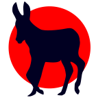

# GraphDonkey

A simple and easy-to-use application for visualizing and editing Graphviz
Dot files, running on `Python 3`. It is based on the idea of `xdot`, combined 
with a texteditor that can live-update the images. Behind the screens, it 
binds `PyQt5` and `graphviz` together.

The idea behind this piece of software sprung from the necessity of creating a
lot of images of finite state automata. In the past, you needed to  have a
texteditor, Graphviz-viewer and a terminal open at all times. Not anymore!

`GraphDonkey`, originally called `DotGaper`, solves this issue by combining 
these applications into one.

**Latest Release Version:** _Jack-in-a-Box_ (`v0.1.1`) 
**Executable OS:** Only `Linux` at this point in time
(maybe Mac as well, but cannot confirm) 
**Author:** Randy Paredis

### Installation and Execution
There are two ways to use `GraphDonkey`. The first is via downloading the
executable and the second is via using it as a repository. There are pros and
cons to each method, so I suggest you read the following sections carefully.

#### Downloading the executable
If you know nothing about programming, or don't want to install any additional
packages, it is best you download the executable (either from zip, or tarball).
Inside, you can find a `GraphDonkey` directory that contains a lot of files.
Somewhere in there, there is a `GraphDonkey` executable that launches the
application (either from the commandline, or from a file browser).

_**Note:** At this current point in time, this method is only available for 
Linux users. Potentially, it can also be executed on a Mac, but I cannot 
confirm this statement. It will, however, **not** work on a Windows-system at
this point in time. If this doesn't work, or if you have created your own
distribution, please let me know._

#### Using the repository
If you cannot use the executable (for one reason or another), or if you prefer
having more flexibility over the code, or if you want to contribute (see
[this page](CONTRIBUTING.md)), you can always clone this repository. From there,
all you have to do is install the requirements (see below) and run `__main__.py`
with python 3 (this may be done in a virtual environment).

_**Note:** Only do this if you know what you're doing. I'm not responsible for
any misconfiguration of your system._

_**Note:** Cloning the repo should allow for a working app, but this is no
guarantee. To be certain, please revert to the latest tag
(version number, preceded with the letter `v`) on the `master` branch._

##### Requirements
_See also `requirements.txt`._
* `PyQt5`
* `graphviz`
* `lark-parser`
* `pytest` (for testing purposes only)

### Known Bugs
Often, bugs can be annoying and frustrating, therefore it is good to inform the
developers of issues you run into. It's better to ask once to many than not ask
at all (this is a general lifeline).

For `GraphDonkey`, some bugs are common and known by me, which I've listed
below. These are on the top of the list to be fixed in a future version.

* RMB menu in the editor is not linked to other functionality.

Did you run into another error or a bug?
[Please let me know!](https://github.com/RandyParedis/GraphDonkey/issues)

##### wontfix
The `wontfix` label is usually associated with bugs that will not get a
solution. This is often used if there are things beyond the developer's control.
Alas, `GraphDonkey` is not in the clear for issues like this. The following
list is a list of bugs that will not be fixed because of the explained reason.

* Copying and cutting text from the editor before closing it clears the
clipboard.
  * This issue is linked to the OS. For efficiency, a clipboard stores a 
  reference to the copied data, instead of the actual data. When the application
  closes, this reference isn't pointing to anything anymore. Without the use of
  a proper clipboard manager, this issue cannot be fixed.

### Copyright
It's important to list your sources if you're working on a project. One does not
have to reinvent the wheel, but rather list the blueprint that was used in
creating it.
* Icons for the GUI came from the [qtango GitHub project](
https://github.com/ppinard/qtango)
* The `GraphDonkey` icon itself was custom-made by me. If you want to use it
elsewhere, you **must** reference this project.

### Changelog
##### Jack-in-a-Box
* [0.1.3] Added controls to view area (and AST-display)
  * Zoom in/out/reset
  * Dragging with mouse
* [0.1.3] Added possibility to show the AST of the current file.
* [0.1.3] Added additional Graphviz configurations
* [0.1.3] Selections/Cursors are now being remembered on startup
* [0.1.3] Added 'Show Whitespace' option to preferences
* [0.1.3] Changed layout
  * Allowed opening of multiple files
  * Changed Icons
* [0.1.2] Better file 'saved' detection
* [0.1.2] Added options to Preferences>Editor:
  * Font family
  * Font size
  * Prefer spaces over tabs checkbox
* [0.1.2] Added File Encoding and Line Ending selectors to Preferences>General
* [0.1.2] Renamed 'Appearance' in the Preferences to 'Theme and Colors'
* [0.1.2] Added Actions for better User experience:
  * Indent/Unindent of current selection or line
  * Possibility to auto-indent selection
  * Turn a selection easily into a comment
  * Duplicate the current selection or line
  * Pressing `ENTER` or `RETURN` will automatically try to indent the new line
  * Entering before a closing bracket (either `}` or `]`) will open a scope
  by adding two lines, both indented accordingly
  * Copy and Cut of empty selections now will be applied on the entire line
  * 'Find and Replace' dialog for easy text manipulation
  * Autocompleter with all keywords of graphviz language
  * Fixed Syntax Error Highlighting
  * Added snippets for quick insert of structures (use RMB)
* [0.1.2] Fixed invalid syntax and error highlighting
* [0.1.2] Changed 'Save' function to saving without typechecking
  * Saving now only allows Graphviz-files to be saved (*.canvas, *.gv, *.dot...)
* [0.1.2] Added new 'Export' function
* [0.1.1] Created first actual release
* [0.1.1] Removed Auto-Updater
* [0.1.1] Added tooltip for syntax error on hover
* [0.1.1] Added different ui styles
  * Burning Berta
  * Dark Doris
  * Fierce Fiona
  * Light Lucy
  * Vicious Victoria
* [0.1.1] Added preferences menu
* [0.1.0] Added auto-render the ui if bug-free
  * This can easily be disabled if required
* [0.1.0] Statusbar now shows the parse error
* [0.1.0] Syntax error highlighting
  * Squiggly underline (default in red)
  * Full token highlights
* [0.1.0] Added automatic check for updates

##### Unnamed Release
* [0.0.2] Added "Recent Files" menu
* [0.0.2] Added testing framework
  * Run `pytest` in the root folder to test
* [0.0.2] Added Custom Icons + App Icon
* [0.0.2] Added flexible shortcut system
* [0.0.2] Editor now works solidly
* [0.0.1] Added ability to render the DOT from the Editor
* [0.0.1] Added Save functionality
  * Save a file to all Graphviz extensions
* [0.0.1] Added Open funtionality
  * From all DOT-file (text) extensions
* [0.0.1] Added New File functionality
* [0.0.1] Added Editor Line Highlighting + Line Numbers
* [0.0.1] Added Basic Editor (with Syntax Highlighting)

### Future Work
Below, I've listed all features I'd like to see in future versions.
[Feel free to suggest new ideas and features!](
https://github.com/RandyParedis/GraphDonkey/issues)
* [0.1.3] Opening from as many file types as possible
* [0.1.3] Additional configuration possibilities for graphviz
* [0.1.3] Allow for multiple files via tabbed pane?
* [0.1.3] Open parse tree of dotfile as dotfile?
* **-- CONVERT TO SEMANTIC VERSIONING --**
* [1.0.0] Interactive view of DOT files
  * Similar to XDot
  * Onclick of node: edit features
  * Quick connections
  * Should make Editor only useful for advanced features
  * [Layers?](https://graphviz.gitlab.io/faq/#FaqOverlays)
* [1.0.0] Add mouse control section to 'Shortcuts' in the Preferences
  * Rename 'Shortcuts' to 'Controls'
* [1.1.0] Add all different node and edge types in interactive mode
* [1.1.1] Add graphviz html syntax highlighting + parsing
* [1.1.2] Continue work on attribute checking (currently discontinued)
* [1.2.0] Add Python scripting engine for live-showing of graph updates
  * This will allow container algorithms to be checked visually
  * Defaultly via 'open'?
  * Toggling of modes
  * How? Run python script and use all captured output as input for graphviz.
* [1.3.0] Multiple Languages
* [1.3.0] Automatic install of updates via app
* [1.3.0] Style/Theme Finder
